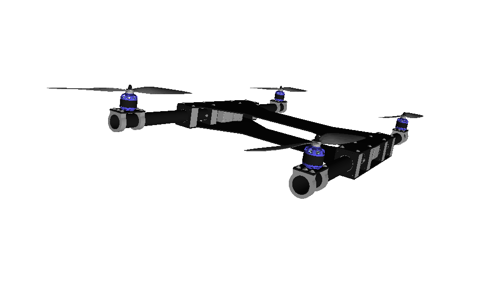

# Lophorina

## Simulação de tilt-quadrirrotor em ROS Gazebo

Este repositório contém o código fonte utilizado para fazer a simulação física do tilt-quadrirrotor lophorina no ROS Gazebo.

Este código pode ser utilizado como um framework, servindo de base para simular outros VANTs.

## Instalação

Instale o ROS, siga os passos para criar um package chamado lophorina e baixe este repositório por cima.

## Funcionamento

Para rodar a simulação:

> roslaunch lophorina lophorina_plain.launch

Para iniciar um controlador (com a simulação aberta):

> rosrun lophorina pid_controller.py

Existem diversos controladores e eles irão executar ações diferentes no robô.

## Customização

Altere o arquivo /urdf/lophorina.urdf para customizar o robô. Os arquivos 3D estão em /meshes/

O arquivo /worlds/lophorina_plain.world contém o mundo vazio, que pode ser modificado dentro do Gazebo ao rodar a simulação e salvo com outro nome. Depois crie um novo arquivo launcher a partir de /launch/lophorina_plain.launch
